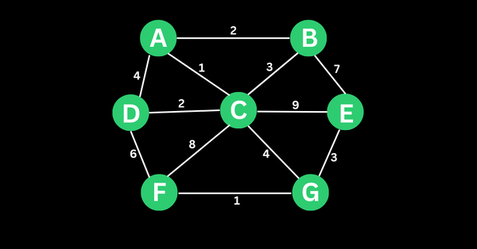
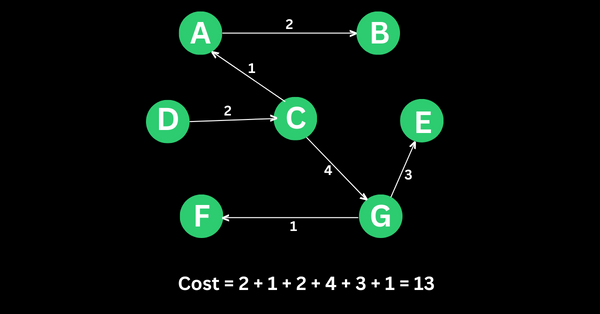
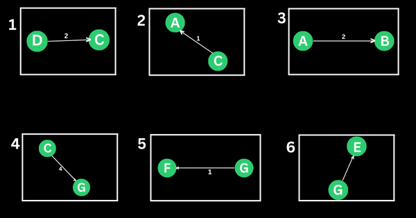
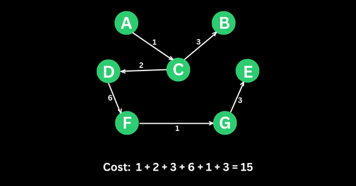
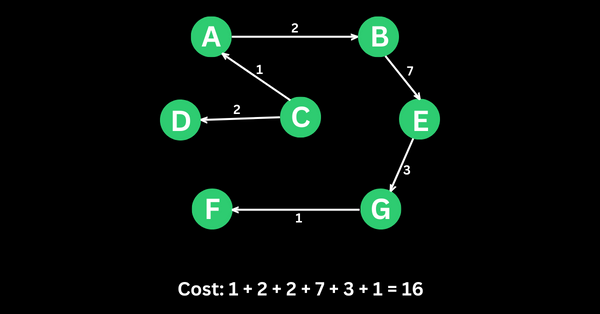
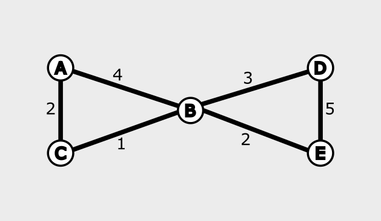
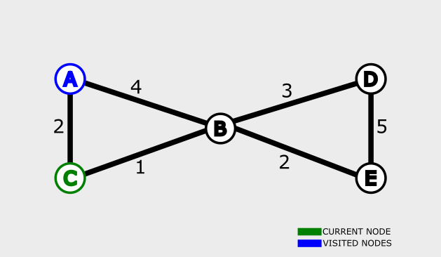
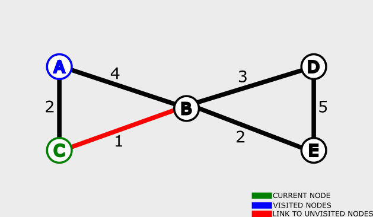
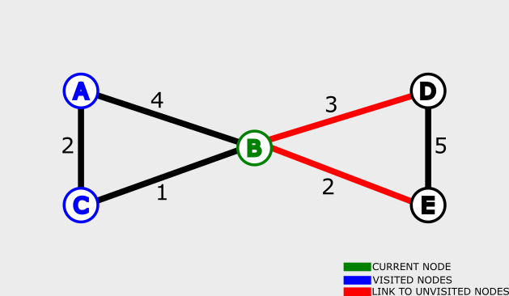
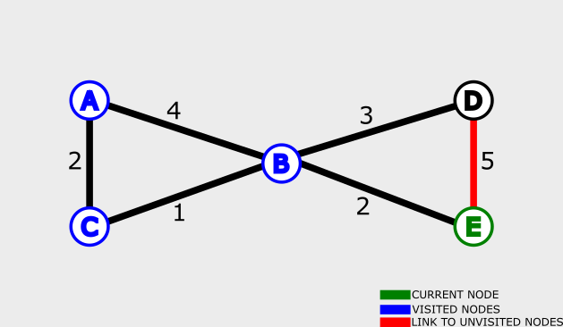

## Graph Algorithms

### Prim's Algorithm/Jarnik's Algorithm

Prim's algorithm helps you find the minimum spanning tree(MST) of a graph.

**Conditions**

There must be no cycle. That is, if A links to B and B links to C, C cannot link to A again because that would make a cycle. Edges is also commonly referred to as *cost*. One of the goals of Prim’s algorithm is to get the minimum cost tree that covers the vertices in the graph without leaving any of them behind.

**Keep in mind during the implementation**

* all the vertices of the graph must be included
* the vertex with the minimum weight must be selected first. You’ll also hear some people refer to that weight as distance, but let’s keep calling it weight.
* all the vertices must be connected
* there must be no cycle

Example as starting point **D** is selected:







```
    A --2-- B
   / \     / \
  4   1   3   7
 /     \ /     \
D --2-- C --9-- E
 \     / \     /
  6   8   4   3
   \ /     \ /
    F --1-- G
```

```
    A --2-# B
     ^        
      1        
       \        
D --2-> C      E
         \     ^
          4   3
           v /
    F <-1-- G
```

```
A --2-- B --3-- C
|     / | \   / | 
4    3  1  4 5  7
| /     | /   \ |
D --2-- C --9-- E
|     / |     / |
6    6  8    4  3
| /     | /     |
F --1-- G --7-- H
```

```
A       D
|\     /|
| 6   3 |
|  \ /  | 
2   B   5 
|  / \  |
| 1   2 |
|/     \|
C       E
```
### Dijkstra 

Helps to find the shortest path from a fixed node to all other nodes in a graph.
Find the shortest path between two nodes, or the shortest path from a fixed node to the rest of the nodes in a graph.
Usually it will be worked with two arrays: Visited and Unvisited Nodes

Example: Starting point is **A**

**Start**



| Node | Shortest Distance |
| ---- | ----------------- |
|   A  |        MAX        |
|   B  |        MAX        |
|   C  |        MAX        |
|   D  |        MAX        |
|   E  |        MAX        |

`VisitedNodes=[]`
`UnvisitedNodes=[A,B,C,D, E]`

**First Iteration**


1. Select Start Node

| Node | Shortest Distance |
| ---- | ----------------- |
|   A  |         0         |
|   B  |        MAX        |
|   C  |        MAX        |
|   D  |        MAX        |
|   E  |        MAX        |

2. Calculate Distance to Unvisited Nodes

| Node | Shortest Distance |
| ---- | ----------------- |
|   A  |         0         |
|   B  |         4         |
|   C  |         2         |
|   D  |        MAX        |
|   E  |        MAX        |

3. Update Arrays

`VisitedNodes=[A]`
`UnvisitedNodes=[B,C,D]`



1. Pick an unvisited Nodes
2. Find the distance to next Nodes
    * If distance is smaller update Table

**Second Iteration**



| Node | Shortest Distance |
| ---- | ----------------- |
|   A  |         0         |
|   B  |         3         |
|   C  |         2         |
|   D  |        MAX        |
|   E  |        MAX        |

`VisitedNodes=[A, C]`
`UnvisitedNodes=[B,D]`

**Third Iteration**




| Node | Shortest Distance |
| ---- | ----------------- |
|   A  |         0         |
|   B  |         3         |
|   C  |         2         |
|   D  |         6         |
|   E  |         5         |

`VisitedNodes=[A, B, C]`
`UnvisitedNodes=[D, E]`

**Fourth Iteration**



| Node | Shortest Distance |
| ---- | ----------------- |
|   A  |         0         |
|   B  |         3         |
|   C  |         2         |
|   D  |         6         |
|   E  |         5         |

`VisitedNodes=[A, B, C, D]`
`UnvisitedNodes=[E]`

**Fifth Iteration**


| Node | Shortest Distance |
| ---- | ----------------- |
|   A  |         0         |
|   B  |         3         |
|   C  |         2         |
|   D  |         6         |
|   E  |         5         |

`VisitedNodes=[A, B, C, D, E]`
`UnvisitedNodes=[]`

