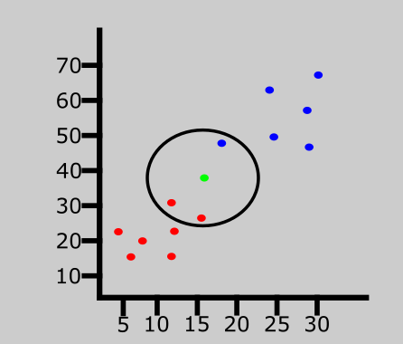
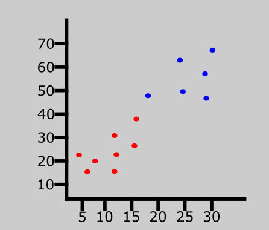

### ML

> This is small repository to practice C++.  
> Try to implement some algorithm in C++.

#### 1 Algorithm: KNN Nearest Neighbor 

Idea of the algorithm: The K-NN algorithm compares a new data entry to the values in a given data set (with different classes or categories). Based on its closeness or similarities in a given range (K (in the example 5 of 7)) of neighbors, the algorithm assigns the new data to a class or category in the data set (training data). 

Here is an example of the (Ablauf)

#### Some additional help notes

* build project: 
  1. `cmake . -B ./build` - prepare cmake build
  2. `cmake --build ./build --config Debug --target ML` - build in debug mode
